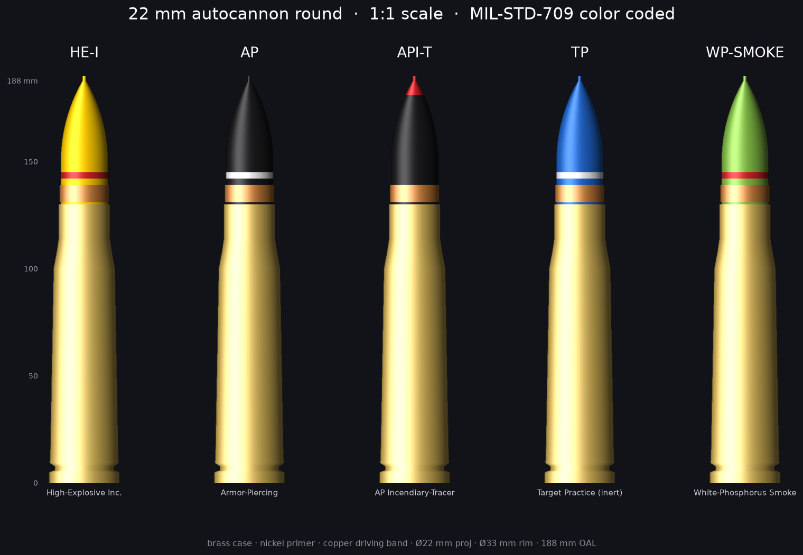

# 22 mm Autocannon Round — 1:1 scale, color-coded 3MF

Faithful, print-ready **1:1 replicas** of a 22 mm ("22 mike-mike") autocannon
cartridge in the **five most common ammunition natures**, color-coded per
**US MIL-STD-709**. Each file is a multi-color 3MF: brass case + nickel primer +
copper driving band + a color-coded projectile.

> These are **inert display models** — solid plastic, no functional parts. See
> *Legal & safety* at the bottom.



## The five variants

| File | Nature | Body | Marking | Real-world meaning |
|------|--------|------|---------|--------------------|
| `..._HE-I.3mf`  | **HE-I**  | Yellow      | red band     | High-Explosive Incendiary |
| `..._AP.3mf`    | **AP**    | Black       | white band   | Armor-Piercing |
| `..._API-T.3mf` | **API-T** | Black       | red nose tip | AP Incendiary-Tracer |
| `..._TP.3mf`    | **TP**    | Blue        | white band   | Target Practice (inert) |
| `..._WP.3mf`    | **WP**    | Light green | red band     | White-Phosphorus smoke |

`22mm_autocannon_1to1_ALL.3mf` contains **all five** laid out on one plate.
The single-variant files each contain one round centered on the plate.

Color code (MIL-STD-709): **yellow = high explosive · black = armor-defeating ·
blue = inert/practice · light green = smoke · red = incendiary / tracer /
WP marker · white = stencil on dark bodies.**

## Dimensions (1:1)

| Feature | Value |
|---|---|
| Caliber (projectile Ø) | **22.0 mm** |
| Rim / base Ø | 33.0 mm |
| Case length | 130 mm (bottlenecked, rimless w/ extractor groove) |
| Overall length (OAL) | **187.7 mm** |
| Projectile | tangent ogive, copper driving band, ~0.8 mm meplat |
| Primer | Ø7.2 mm nickel cup, centered in the base |

Proportions follow the real 20–25 mm autocannon family (e.g. 20×102, 23×152,
25×137). "22 mm" isn't a single famous NATO caliber, so this is a
dimensionally-authentic 22 mm-class cartridge rather than a copy of one specific
factory round — accurate to how these rounds actually look and scale.

## Printing

Every round is one object made of **separate, already-colored parts**, so it
works two ways:

### A) One-piece multicolor (AMS / AMS lite)
1. Open the `.3mf` in **Bambu Studio**. You'll see one object with 5–6 parts.
2. The file carries a 9-color material palette. Map each to an AMS slot
   (see the filament table). Parts shared by every round: **gold (brass),
   copper, silver (primer)**.
3. Orient **base down** (as supplied), add a **brim** (tall + narrow → helps
   adhesion), slice, print. No supports needed — the ogive is self-supporting
   and the only overhang (under the rim) is < 2 mm.

Per-round you need at most 5 colors, so a single 4-slot AMS + one hand swap, or
two AMS units, prints any one variant. To print several at once, batch rounds
that share colors.

### B) No AMS — print in parts, then glue
The parts are separate bodies, so you can print each in a single filament:
1. Right-click the object → **Split to Parts / Objects**.
2. Print the **case** (gold), **primer** (silver), **driving band** (copper) and
   **projectile** (its color) separately — all print flat-out with no supports.
3. Glue with CA (super) glue. The projectile has a 12 mm locating collar that
   seats into the case mouth; the primer drops into the base pocket. For an
   easy fit, scale the projectile to ~99 % or lightly sand the collar.

**Suggested slicer settings:** 0.12–0.16 mm layer height (0.12 mm shows the
ogive curve and driving band crisply), 3 walls, 15 % infill, PLA. These are
display pieces — no strength requirements.

## Bambu Lab filament shopping list

Best realism = **metallic/silk** for the metal parts and **matte** for the
painted-ordnance projectile colors. Target colors and closest Bambu options:

| Part (palette name) | Target | Bambu Lab filament (recommended) | Budget/matte alt |
|---|---|---|---|
| Brass case | brass gold | **PLA Silk+ Gold** (metallic) | PLA Basic Gold `#E4BD68` |
| Copper driving band | copper | **PLA Silk+ Copper** *(or PLA Metal Copper Brown)* | PLA Basic — Brown/Orange mix |
| Nickel primer | silver | **PLA Silk+ Silver** | PLA Basic Silver |
| HE body | yellow | **PLA Matte Lemon Yellow** | PLA Basic Yellow `#F4EE2A` |
| AP / stencil body | black | **PLA Matte Charcoal (Black)** | PLA Basic Black |
| TP body | blue | **PLA Matte Marine Blue** | PLA Basic Blue `#0A2CA5` |
| Smoke body | light green | **PLA Matte Grass Green** | PLA Basic Green `#00AE42` |
| Marker (band/tip) | red | **PLA Matte Scarlet Red** | PLA Basic Red `#C12E1F` |
| Stencil band | white | **PLA Matte Ivory White** | PLA Basic White |

**If you want the smallest buy:**
- **3 "metal" spools** — Gold, Copper, Silver — are reused by *every* round.
- **6 "projectile" spools** — Yellow, Black, Blue, Green, Red, White — cover the
  color coding of all five (and Black + White + Red also serve as markings).

That **9-spool palette prints the whole set**. Want just one round? Buy the 3
metals plus that round's colors (e.g. HE-I = Gold, Copper, Silver, Yellow, Red).

PLA is ideal here (cheap, easy, great matte/silk finishes). PETG or resin also
work if you prefer; resin (or a 0.2 mm nozzle) will resolve the driving band and
meplat even more sharply.

## Regenerating / customizing

`generate.py` (pure Python stdlib) builds every `.3mf` parametrically — change a
dimension or color constant and re-run:

```bash
python3 generate.py            # writes all 6 .3mf files
python3 validate_preview.py    # checks the packages + renders preview.png (needs numpy, matplotlib)
```

Geometry is generated as watertight solids of revolution; each part is verified
manifold (0 non-manifold edges) at build time.

## Legal & safety

These are **solid, inert display replicas** — no case cavity, no primer/
propellant/explosive function, and not designed to chamber or fire. They just
*look* like cartridges. Replica-ordnance rules vary by country and region;
please check your local laws before printing, displaying, selling, or shipping,
and don't represent them as live ammunition.
