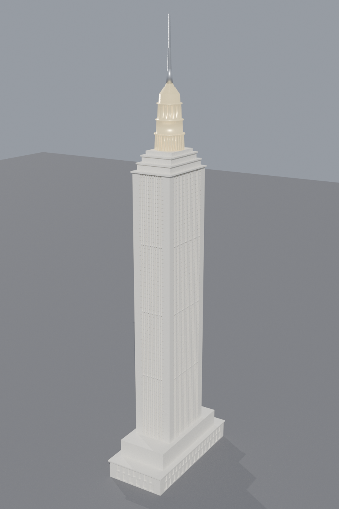
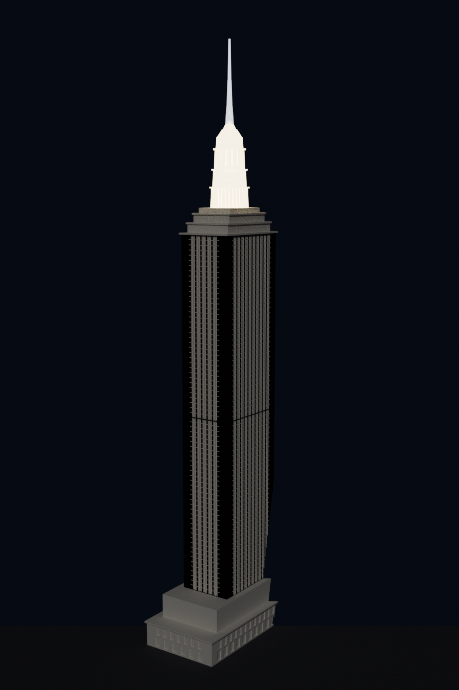

# Empire State Building — high-detail sectioned 3D-print model

A parametric, historically-grounded model of the Empire State Building (Shreve,
Lamb & Harmon, 1931), built for multi-printer sectioned printing. Every dimension
comes from the real building's massing and Art Deco facade grammar — not a
generative guess. Built with `trimesh`/`manifold3d`, rendered in Blender, with an
editable OpenSCAD twin.

| | |
|---|---|
|  |  |
| Day — limestone + lit crown | Night — the glowing mooring-mast crown |

## What's in here

| File | What it is |
|------|-----------|
| `empire_state_building.py` | Main generator — solid, sectioned model. Punched-window grid (paired windows + mullions), per-floor spandrel reveals, setback cornices, tiered ribbed crown. Auto-splits the tower to your printer bed height. |
| `empire_state_building.scad` | Editable **OpenSCAD** twin (massing + piers). `openscad -o esb.stl empire_state_building.scad`. |
| `wall_panels.py` | **4-wall-plate variant** — each tower band as 4 flat-backed facade plates that interlock at the corners (tab-and-slot) into a hollow ring. |
| `facade_detail.py` | **Extreme-detail facade panel** (large scale) — real windows (frame, mullion, divided lights, sill, lintel), Art Deco spandrels, and coursed running-bond masonry. |
| `render.py` / `facade_render.py` | Headless Blender renders (whole-building set; and the facade panel close-up). |
| `stl/` | 6 solid sections + full-assembly preview. |
| `stl_panels/` | 8 wall plates (2 tower bands × 4 walls). |

Regenerate: `python3 empire_state_building.py` · Panels: `python3 wall_panels.py` ·
Render: `blender -b -P render.py`. The repo's SessionStart hook installs OpenSCAD,
Blender and the Python libs automatically in Claude Code on the web.

## Print plan — solid sections (0.40 mm/ft → ~582 mm / 23″ assembled)

| # | File | W × D × H (mm) | Filament | Notes |
|---|------|----------------|----------|-------|
| 1 | `01_base.stl` | 82.0 × 173.2 × 50.4 | stone grey | arcade + windows + 5th-floor cornice; needs a bed ≥180 mm one axis |
| 2 | `02_shaft_1of2.stl` | 52.8 × 84 × 178.4 | stone grey | punched window grid; print upright, **no supports** |
| 3 | `03_shaft_2of2.stl` | 52.8 × 84 × 178.4 | stone grey | print upright |
| 4 | `04_setbacks.stl` | 56.0 × 87.2 × 27.2 | stone grey | stepped cornices + 86th-fl deck |
| 5 | `05_crown.stl` | 38.4 × 38.4 × 80.8 | **translucent** | ribbed mast + lantern → LED-backlight showpiece |
| 6 | `06_spire.stl` | 8.0 × 8.0 × 78.4 | grey | fragile needle — brim it, or swap for a 1 mm rod |

`00_full_assembly_preview.stl` = all sections in place, for viewing only.

### Fit to your printer
Set `MAX_PART_H_MM` at the top of `empire_state_building.py` to your bed height —
the tower auto-splits into that many stacked bands. The report flags any section
whose footprint exceeds the bed.

## Single- vs multi-color
The real building is essentially one color (Indiana limestone). The only truly
multi-color element is the illuminated crown at night — so print sections 1–4 + 6
in one stone filament across as many printers as you like, and print **section 5
in translucent** to backlight with an LED. All color management stays on one part.

## Two ways to build the tower walls
- **Solid sections** (`stl/`) — robust, simplest, relief on all four faces.
- **4 wall plates** (`stl_panels/`) — hollow-shell facade panels (N/S/E/W) that
  interlock at the corners; lighter, and each plate lies flat to show its masonry.

## Extreme-detail facade panels (large scale)
Individual masonry blocks and true window frames are physically smaller than a
printer can resolve at the whole-building scale (a limestone block is ~0.8 mm at
1:762). To get real masonry + real windows, model a **section of the elevation at
large scale**: `facade_detail.py` generates a parametric panel (default 3 bays ×
4 floors at ~1:95 → ~154 × 157 mm) with recessed windows (frame, central mullion,
divided lights, projecting sill, lintel), fluted Art Deco spandrels, and coursed
running-bond limestone. It prints flat (back down, relief up — no supports).
Raise `N_BAYS`/`N_FLOORS` or tile panels to cover a whole elevation, and set
`MM_PER_FT` for the scale you want to print.

`render_facade.png` is the Blender close-up.

## Assembly
Each section/plate has central alignment pins (peg on top / socket on bottom, and
corner splines on the plates). Dry-fit (≈ 0.6 mm clearance, glue-friendly), stack
base → shaft → setbacks → crown → spire, and bond seams with CA or epoxy.
